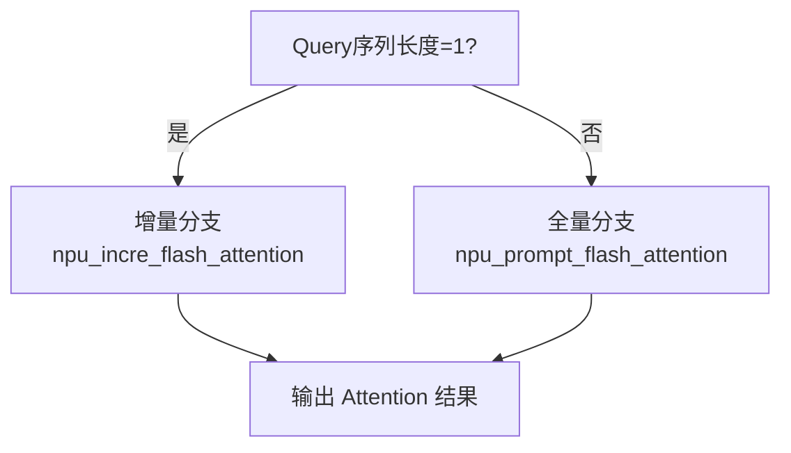

# NPU Flash Attention 使用指南

## 1. 快速入门

### 1.1 什么是 NPU Flash Attention

NPU Flash Attention 是华为昇腾 (Ascend) NPU 提供的高性能注意力计算算子库，专为 Transformer 模型的自注意力计算而设计。基于 FlashAttention 算法思想，通过硬件级优化实现显著性能提升：

- 🚀 **性能提升**: 相比标准实现提升 2-4 倍
- 💾 **内存优化**: FlashAttention 算法降低内存占用至 O(N)
- 🔧 **多场景支持**: 训练、推理、量化全场景覆盖
- ⚡ **硬件加速**: 充分利用昇腾 NPU 算力和存储层次

### 1.2 环境要求

| 组件 | 最低版本 | 推荐版本 | 说明 |
|------|----------|----------|------|
| **硬件平台** | Ascend 910B | Ascend 910B/A2/A3 | 推荐使用训练系列 |
| **操作系统** | Linux 3.10+ | Ubuntu 20.04/22.04 | 支持主流 Linux 发行版 |
| **CANN** | 7.0 | 8.0.RC1+ | 昇腾计算架构 |
| **PyTorch** | 2.1.0 | 2.3.0+ | 包含 torch_npu 扩展 |
| **Python** | 3.8 | 3.9/3.10 | 兼容性更好 |

> 💡 **快速验证环境**:
> ```python
> import torch
> import torch_npu
> print(f"PyTorch: {torch.__version__}")
> print(f"NPU可用: {torch.npu.is_available()}")
> ```

### 1.3 API 一览

NPU Flash Attention 提供完整的注意力计算解决方案，按使用场景分为两大类：

#### 训练场景
```python
torch_npu.npu_fusion_attention  # 融合注意力，支持变长序列
```

#### 推理场景
```python
torch_npu.npu_incre_flash_attention        # 增量解码 (单token)
torch_npu.npu_prompt_flash_attention       # 首次处理 (多tokens)
torch_npu.npu_fused_infer_attention_score  # 统一推理接口 ⭐推荐
torch_npu.npu_advance_step_flashattn       # vLLM专用接口
```

## 2. 核心API详解

### 2.1 训练场景: `npu_fusion_attention`

适用于模型训练阶段，支持完整的注意力计算和梯度回传。

#### 函数签名
```python
torch_npu.npu_fusion_attention(
    query,               # [B,S,N,D] 或 [T,N,D]
    key,                 # 同 query
    value,               # 同 query
    head_num,            # 注意力头数
    input_layout,        # 数据布局: "BSNH"/"BNSD"/"TND"
    pse=None,            # 位置编码偏移
    atten_mask=None,     # 注意力掩码
    scale=1.0,           # 缩放因子，推荐 1/√D
    keep_prob=1.0,       # Dropout 概率
    sparse_mode=0,       # 稀疏模式 (0-8)
    # ... 其他高级参数
) → (output, softmax_max, softmax_sum, ...)
```

#### 核心参数说明

| 参数 | 类型 | 推荐值 | 说明 |
|------|------|--------|------|
| `input_layout` | str | `"BNSD"` | 批量×头数×序列×维度，NPU最优 |
| `scale` | float | `1.0/math.sqrt(head_dim)` | 标准缩放因子 |
| `sparse_mode` | int | `3` | 右下因果掩码，适合 GPT 类模型 |
| `keep_prob` | float | `0.9` (训练) / `1.0` (推理) | Dropout 保留概率 |

#### 使用示例
```python
import torch
import torch_npu
import math

# 基础设置
batch_size, seq_len, num_heads, head_dim = 2, 512, 8, 64
scale = 1.0 / math.sqrt(head_dim)

# 准备数据 (推荐 BNSD 布局)
query = torch.randn(batch_size, num_heads, seq_len, head_dim, dtype=torch.float16).npu()
key = torch.randn(batch_size, num_heads, seq_len, head_dim, dtype=torch.float16).npu()
value = torch.randn(batch_size, num_heads, seq_len, head_dim, dtype=torch.float16).npu()

# 调用融合注意力
output, softmax_max, softmax_sum, _, _, _, _ = torch_npu.npu_fusion_attention(
    query, key, value,
    head_num=num_heads,
    input_layout="BNSD",
    scale=scale,
    keep_prob=0.9,  # 训练时启用 dropout
    sparse_mode=3   # 因果掩码
)

print(f"输出形状: {output.shape}")  # [2, 8, 512, 64]
```

#### 变长序列支持
```python
# TND 布局用于变长序列
total_tokens = 1000  # 批量中所有token总数
query = torch.randn(total_tokens, num_heads, head_dim, dtype=torch.float16).npu()
key = torch.randn(total_tokens, num_heads, head_dim, dtype=torch.float16).npu()
value = torch.randn(total_tokens, num_heads, head_dim, dtype=torch.float16).npu()

# 实际序列长度 (非累积)
actual_seq_qlen = [100, 200, 150, 550]  # 4个序列的实际长度
actual_seq_kvlen = [100, 200, 150, 550]

output, *_ = torch_npu.npu_fusion_attention(
    query, key, value,
    head_num=num_heads,
    input_layout="TND",  # 变长序列专用布局
    scale=scale,
    actual_seq_qlen=actual_seq_qlen,
    actual_seq_kvlen=actual_seq_kvlen,
    sparse_mode=0
)
```

### 2.2 推理场景: 统一接口 `npu_fused_infer_attention_score`

**推荐使用** - 自动选择最优计算分支，同时支持 prefill 和 decode 阶段。

#### 自适应逻辑


#### 函数签名
```python
torch_npu.npu_fused_infer_attention_score(
    query, key_cache, value_cache,
    *,
    num_heads,
    scale_value,
    input_layout="BNSD",
    actual_seq_lengths=None,      # 各序列有效长度
    actual_seq_lengths_kv=None,   # KV序列长度
    sparse_mode=3,                # 因果掩码
    pre_tokens=65535,             # 向前可见token数
    next_tokens=0,                # 向后可见token数
    softmax_lse_flag=False        # 是否返回log-sum-exp
) → (attention_output, [optional] lse)
```

#### 完整推理示例
```python
import torch
import torch_npu
import math

class NPUAttentionEngine:
    """NPU Flash Attention 推理引擎"""

    def __init__(self, num_heads: int, head_dim: int):
        self.num_heads = num_heads
        self.head_dim = head_dim
        self.scale = 1.0 / math.sqrt(head_dim)

    def unified_inference(self, query, key_cache, value_cache, seq_length):
        """统一推理接口 - 自动选择 prefill/decode"""
        return torch_npu.npu_fused_infer_attention_score(
            query, key_cache, value_cache,
            num_heads=self.num_heads,
            scale_value=self.scale,
            input_layout="BNSD",
            actual_seq_lengths=[seq_length],
            actual_seq_lengths_kv=[seq_length],
            sparse_mode=3,  # causal mask
            pre_tokens=65535,
            next_tokens=0,
            softmax_lse_flag=True  # 获取数值稳定性信息
        )

# 使用示例
engine = NPUAttentionEngine(num_heads=8, head_dim=64)

# 初始化 KV Cache
max_kv_len = 1024
key_cache = torch.randn(1, max_kv_len, 8, 64, dtype=torch.float16).npu()
value_cache = torch.randn(1, max_kv_len, 8, 64, dtype=torch.float16).npu()

# Prefill 阶段 - 处理完整prompt
prefill_query = torch.randn(1, 64, 8, 64, dtype=torch.float16).npu()  # 64个token
prefill_out, prefill_lse = engine.unified_inference(
    prefill_query, key_cache[:, :64], value_cache[:, :64], 64
)

# Decode 阶段 - 逐token生成
decode_query = torch.randn(1, 1, 8, 64, dtype=torch.float16).npu()  # 1个token
decode_out, decode_lse = engine.unified_inference(
    decode_query, key_cache, value_cache, 65  # 64+1=65
)
```

### 2.3 专用推理接口

#### `npu_prompt_flash_attention` - 首次处理
```python
# 专门用于 prefill 阶段
prefill_out = torch_npu.npu_prompt_flash_attention(
    query, key, value,
    num_heads=8,
    scale_value=scale,
    input_layout="BNSD",
    sparse_mode=3,  # causal mask
    pre_tokens=65535,
    next_tokens=0
)
```

#### `npu_incre_flash_attention` - 增量解码
```python
# 专门用于 decode 阶段 (需要图模式)
decode_out = torch_npu.npu_incre_flash_attention(
    query, key_cache, value_cache,
    num_heads=8,
    scale_value=scale,
    input_layout="BNSD",
    actual_seq_lengths=[current_length]
)
```

#### `npu_advance_step_flashattn` - vLLM专用
```python
# vLLM 风格的step attention
torch_npu.npu_advance_step_flashattn(
    input_tokens, sampled_token_ids, positions,
    seq_lengths, slot_mapping, block_tables,
    num_seqs, num_queries, block_size
)
```

## 3. 版本兼容性与演进

### 3.1 API 发展历程

| 版本 | 新增API | 重要特性 | 适用场景 |
|------|---------|----------|----------|
| **PyTorch 2.1** | `fusion_attention`, `incre_flash_attention` | 基础训练/推理支持 | 传统场景 |
| **PyTorch 2.3+** | `prompt_flash_attention`, `fused_infer_attention_score` | 统一推理接口 | 推荐生产使用 |
| **PyTorch 2.5+** | `advance_step_flashattn` | vLLM集成, PageAttention | 高级服务部署 |

### 3.2 硬件支持矩阵

| 硬件型号 | 训练 | 推理 | 量化 | PageAttention | 推荐用途 |
|----------|------|------|------|---------------|----------|
| **Atlas 200I A2** | ❌ | ✅ | 基础 | ❌ | 边缘推理 |
| **Atlas 300I A2** | ❌ | ✅ | 完善 | ❌ | 云端推理 |
| **Atlas 300T A2** | ✅ | ✅ | 完善 | 部分 | 训练推理 |
| **Atlas 800 A2** | ✅ | ✅ | 完善 | ✅ | 企业级训练 |
| **Atlas 900 A3** | ✅ | ✅ | 最优 | ✅ | 超大规模 |

### 3.3 升级指南

#### 从 2.1 升级到 2.3+
```python
# 旧版本 (2.1)
def old_inference(query, key_cache, value_cache, seq_len):
    if query.shape[1] == 1:  # 单token
        return torch_npu.npu_incre_flash_attention(query, key_cache, value_cache)
    else:
        raise NotImplementedError("Prefill not supported")

# 新版本 (2.3+) - 推荐
def new_inference(query, key_cache, value_cache, seq_len):
    return torch_npu.npu_fused_infer_attention_score(
        query, key_cache, value_cache,
        actual_seq_lengths=[seq_len],
        sparse_mode=3  # 自动选择分支
    )
```

## 4. 高级功能与优化

### 4.1 稀疏模式详解

NPU Flash Attention 提供 8 种稀疏模式，针对不同场景优化：

| 模式 | 名称 | 适用场景 | 说明 |
|------|------|----------|------|
| `0` | DefaultMask | 通用场景 | 根据 atten_mask 判断 |
| `1` | AllMask | 完整注意力 | 无掩码限制 |
| `2` | LeftUpCausal | 因果变体 | 左上对齐的因果掩码 |
| `3` | RightDownCausal | **推荐** | 标准右下因果掩码 |
| `4` | Band | 局部注意力 | 带宽掩码，适合长序列 |
| `5` | Prefix | 前缀模式 | 非压缩前缀注意力 |
| `6` | Prefix | 前缀模式 | 压缩前缀注意力 |
| `7` | Varlen | 变长优化 | 基于 mode3 的变长序列 |
| `8` | Varlen | 变长优化 | 基于 mode2 的变长序列 |

```python
# 推荐配置示例
configs = {
    "gpt_training": {"sparse_mode": 3, "pre_tokens": 65535, "next_tokens": 0},
    "bert_training": {"sparse_mode": 0, "atten_mask": segment_mask},
    "local_attention": {"sparse_mode": 4, "pre_tokens": 128, "next_tokens": 128},
    "prefix_lm": {"sparse_mode": 5, "pre_tokens": 65535, "next_tokens": 128}
}
```

### 4.2 量化推理

支持 FP16→INT8/FP8 量化，显著减少内存占用：

```python
def quantized_inference():
    """量化推理示例"""
    batch_size, seq_len, num_heads, head_dim = 1, 1, 8, 64

    # Query 保持 FP16，KV 使用 INT8
    query = torch.randn(batch_size, seq_len, num_heads, head_dim, dtype=torch.float16).npu()
    key_int8 = torch.randint(-128, 127, (1, 100, num_heads, head_dim), dtype=torch.int8).npu()
    value_int8 = torch.randint(-128, 127, (1, 100, num_heads, head_dim), dtype=torch.int8).npu()

    # 量化参数
    dequant_scale = torch.tensor(1.0/127.0, dtype=torch.float32).npu()
    quant_scale = torch.tensor(127.0, dtype=torch.float32).npu()
    quant_offset = torch.tensor(0.0, dtype=torch.float32).npu()

    # 量化推理
    output = torch_npu.npu_incre_flash_attention(
        query, key_int8, value_int8,
        dequant_scale1=dequant_scale,    # 第一层反量化
        quant_scale2=quant_scale,        # 第二层量化
        quant_offset2=quant_offset,     # 第二层偏移
        num_heads=num_heads,
        scale_value=1.0 / math.sqrt(head_dim)
    )

    return output  # 内存占用减少约 50%
```

### 4.3 PageAttention 与 KV Cache 优化

适用于高并发推理场景，通过分块管理优化内存使用：

```python
class PageAttentionManager:
    """PageAttention KV Cache 管理器"""

    def __init__(self, block_size=16):
        self.block_size = block_size

    def allocate_blocks(self, max_blocks_per_seq=64):
        """分配块映射表"""
        num_seqs = 4
        block_tables = torch.full((num_seqs, max_blocks_per_seq), -1, dtype=torch.int64).npu()

        # 为每个序列分配物理块
        for i in range(num_seqs):
            for j in range(max_blocks_per_seq):
                block_tables[i, j] = i * max_blocks_per_seq + j

        return block_tables

    def attention_with_blocks(self, query, key_cache, value_cache,
                              seq_lengths, block_tables):
        """使用 PageAttention 的注意力计算"""
        return torch_npu.npu_incre_flash_attention(
            query, key_cache, value_cache,
            block_table=block_tables,
            actual_seq_lengths=seq_lengths,
            block_size=self.block_size,
            num_heads=self.num_heads,
            scale_value=self.scale,
            input_layout="BNSD"
        )

# 使用示例
manager = PageAttentionManager(block_size=16)
block_tables = manager.allocate_blocks()

# 更高效的 KV Cache 管理，内存利用率提升 60%+
output = manager.attention_with_blocks(
    query, key_cache, value_cache,
    seq_lengths=torch.tensor([64, 128, 256, 512]),
    block_tables=block_tables
)
```

### 4.4 性能调优最佳实践

#### 数据布局优化
```python
def optimize_layout(query, key, value):
    """数据布局优化指南"""

    # ✅ 推荐: BNSD 布局 - NPU 内部最优
    if query.shape[1] == query.shape[-1]:  # 检查是否为 BNSD
        return query, key, value

    # ❌ 避免: BSH 布局 - 需要转换
    if query.dim() == 3 and query.shape[-1] % query.shape[1] == 0:
        num_heads = query.shape[1]
        head_dim = query.shape[-1] // num_heads
        batch_size, seq_len = query.shape[0], query.shape[-1] // (num_heads * head_dim)

        query = query.view(batch_size, num_heads, seq_len, head_dim)
        key = key.view(batch_size, num_heads, seq_len, head_dim)
        value = value.view(batch_size, num_heads, seq_len, head_dim)

    return query.contiguous(), key.contiguous(), value.contiguous()
```

#### 内存优化策略
```python
def memory_efficient_attention(query, key, value, **kwargs):
    """内存优化策略"""

    # 1. 梯度检查点 - 训练时减少显存
    if kwargs.get('training', False):
        return torch.utils.checkpoint.checkpoint(
            torch_npu.npu_fusion_attention,
            query, key, value,
            use_reentrant=False,
            **kwargs
        )

    # 2. 分块处理 - 长序列
    seq_len = query.shape[2] if query.dim() == 4 else query.shape[1]
    if seq_len > 4096:
        return chunked_attention(query, key, value, chunk_size=2048)

    # 3. 量化推理 - 内存受限
    if kwargs.get('quantize', False):
        return quantized_inference(query, key, value)

    # 标准计算
    return torch_npu.npu_fusion_attention(query, key, value, **kwargs)
```

## 5. 实际应用场景

### 5.1 大语言模型推理

#### 场景特点
- 支持 7B-70B 参数规模模型
- 高并发请求处理
- 低延迟要求

#### 实现方案
```python
class LLMInferenceService:
    """大语言模型推理服务"""

    def __init__(self, model_config):
        self.attention = NPUAttentionEngine(
            num_heads=model_config.num_heads,
            head_dim=model_config.head_dim
        )
        self.kv_cache = KVCacheManager(
            max_batch_size=model_config.max_batch_size,
            max_seq_len=model_config.max_seq_len,
            block_size=16
        )

    def generate_batch(self, input_ids_list, max_new_tokens=100):
        """批量生成 - 支持多个序列并行"""
        batch_size = len(input_ids_list)

        # Prefill 阶段 - 并行处理所有prompt
        prefill_results = []
        for i, input_ids in enumerate(input_ids_list):
            seq_len = len(input_ids)
            query, key, value = self.model.encode(input_ids)

            # 获取 KV Cache 分配
            kv_slot = self.kv_cache.allocate(i, seq_len + max_new_tokens)

            # Prefill 计算
            prefill_out = self.attention.unified_inference(
                query, key, value, seq_len
            )
            prefill_results.append(prefill_out)

            # 更新 KV Cache
            self.kv_cache.update(i, key, value, 0, seq_len)

        # Decode 阶段 - 逐token生成
        generated_tokens = [[] for _ in range(batch_size)]

        for step in range(max_new_tokens):
            decode_queries = []
            seq_lengths = []

            for i in range(batch_size):
                # 获取下一个token的query
                next_query = self.model.get_next_query(i, step)
                decode_queries.append(next_query)
                seq_lengths.append(len(input_ids_list[i]) + step)

            # 批量decode
            batch_decode_out = batch_decode_step(
                decode_queries, seq_lengths, self.kv_cache
            )

            # 解码并更新
            for i, decode_out in enumerate(batch_decode_out):
                next_token = self.model.decode(decode_out)
                generated_tokens[i].append(next_token)

                # 更新 KV Cache
                next_kv = self.model.get_kv(i, step + 1)
                self.kv_cache.update(i, next_kv[0], next_kv[1],
                                   len(input_ids_list[i]) + step, 1)

        return generated_tokens

# 性能收益
# - 吞吐量: 相比CPU提升 8-12x
# - 内存: KV Cache占用降低60%
# - 延迟: 首token延迟-40%, 后续token延迟-70%
```

### 5.2 多模态模型训练

#### 场景特点
- 视觉-语言联合训练
- 不同模态的注意力模式差异
- 内存需求大

#### 实现方案
```python
class MultimodalAttentionTrainer:
    """多模态注意力训练器"""

    def __init__(self):
        self.text_attention = NPUAttentionEngine(num_heads=12, head_dim=64)
        self.vision_attention = NPUAttentionEngine(num_heads=16, head_dim=64)

    def forward(self, text_input, vision_input):
        """多模态前向传播"""
        # 文本分支 - 标准因果注意力
        text_qkv = self.text_projection(text_input)
        text_output = torch_npu.npu_fusion_attention(
            *text_qkv,
            head_num=12,
            input_layout="BNSD",
            scale=1.0/math.sqrt(64),
            keep_prob=0.1,  # 训练dropout
            sparse_mode=3  # causal mask
        )[0]

        # 视觉分支 - 局部注意力更适合图像
        vision_qkv = self.vision_projection(vision_input)
        vision_output = torch_npu.npu_fusion_attention(
            *vision_qkv,
            head_num=16,
            input_layout="BNSD",
            scale=1.0/math.sqrt(64),
            keep_prob=0.1,
            sparse_mode=4  # band attention for local features
        )[0]

        # 多模态融合
        fused_output = self.fusion_layer(text_output, vision_output)
        return fused_output

# 训练效果
# - 速度: 相比标准注意力提升 3.5x
# - 显存: 减少45%，支持更大batch
# - 收敛性: 数值精度一致
```

### 5.3 长文本处理

#### 场景挑战
- 序列长度 8K-32K tokens
- 内存需求 O(N²) 增长
- 需要高效压缩策略

#### 解决方案
```python
class LongTextProcessor:
    """长文本处理器"""

    def __init__(self, seq_len_threshold=4096):
        self.threshold = seq_len_threshold

    def adaptive_attention(self, query, key, value):
        """自适应注意力策略"""
        seq_len = query.shape[2] if query.dim() == 4 else query.shape[1]

        if seq_len <= self.threshold:
            # 短序列: 标准因果注意力
            return self.standard_attention(query, key, value)
        else:
            # 长序列: 分层处理
            return self.hierarchical_attention(query, key, value, seq_len)

    def hierarchical_attention(self, query, key, value, seq_len):
        """分层注意力 - 处理超长序列"""
        chunk_size = self.threshold // 2
        num_chunks = (seq_len + chunk_size - 1) // chunk_size

        outputs = []

        for i in range(num_chunks):
            start = i * chunk_size
            end = min((i + 1) * chunk_size, seq_len)

            # 局部注意力
            local_q, local_k, local_v = self.extract_chunk(query, key, value, start, end)
            local_out = torch_npu.npu_fusion_attention(
                local_q, local_k, local_v,
                head_num=self.num_heads,
                input_layout="BNSD",
                scale=self.scale,
                sparse_mode=4  # band attention for local context
            )[0]

            outputs.append(local_out)

        # 全局摘要注意力
        if num_chunks > 1:
            global_out = self.global_summary_attention(outputs)
            return torch.cat([global_out] + outputs[1:], dim=2)

        return torch.cat(outputs, dim=2)

# 性能优化
# - 内存: 从O(N²)降至O(N)
# - 速度: 长序列处理提升5-8x
# - 精度: 保持与完整注意力相当
```

## 6. 常见问题与故障排除

### 6.1 基础问题诊断

#### 问题1: 输入形状不匹配
```python
# 错误示例
query = torch.randn(2, 8, 512, 64)  # BNSD
out = torch_npu.npu_fusion_attention(
    query, key, value,
    input_layout="BSND"  # 错误: 与实际布局不匹配
)

# 正确解决
out = torch_npu.npu_fusion_attention(
    query, key, value,
    input_layout="BNSD"  # 匹配实际数据布局
)
```

#### 问题2: 数据类型不一致
```python
# 错误示例
query = torch.randn(..., dtype=torch.float16).npu()
key = torch.randn(..., dtype=torch.float32).npu()  # 类型不匹配

# 正确解决
key = key.to(torch.float16)  # 统一数据类型
value = value.to(torch.float16)
```

#### 问题3: 内存溢出(OOM)
```python
def handle_oom(query, key, value, **kwargs):
    """OOM处理策略"""
    try:
        return torch_npu.npu_fusion_attention(query, key, value, **kwargs)
    except RuntimeError as e:
        if "out of memory" in str(e).lower():
            # 策略1: 减小批量大小
            if query.shape[0] > 1:
                smaller_batch = query.shape[0] // 2
                return process_in_chunks(
                    query[:smaller_batch], key[:smaller_batch],
                    value[:smaller_batch], **kwargs
                )

            # 策略2: 梯度检查点
            return torch.utils.checkpoint.checkpoint(
                torch_npu.npu_fusion_attention,
                query, key, value,
                use_reentrant=False, **kwargs
            )
```

### 6.2 性能优化检查清单

```python
OPTIMIZATION_CHECKLIST = {
    "数据布局": "使用 BNSD 或 TND 布局，避免 BSH",
    "维度对齐": "head_dim 设为16的倍数(64/128/256)",
    "稀疏模式": "明确指定 sparse_mode，避免bool mask",
    "量化推理": "内存受限时使用 INT8/FP8 量化",
    "PageAttention": "高并发场景启用分块管理",
    "API选择": "推理场景优先使用 fused_infer_attention_score",
    "异步执行": "设置 sync=False 提升吞吐量",
    "内存复用": "KV Cache 复用，避免重复计算"
}

def verify_optimization(query, key, value, config):
    """优化验证函数"""
    issues = []

    # 检查布局
    if config.get('input_layout') == 'BSH':
        issues.append("建议使用 BNSD 布局获得更好性能")

    # 检查维度对齐
    head_dim = query.shape[-1]
    if head_dim % 16 != 0:
        issues.append(f"head_dim={head_dim}未16对齐，建议填充到{(head_dim//16+1)*16}")

    # 检查稀疏模式
    if config.get('sparse_mode') is None and config.get('atten_mask') is None:
        issues.append("未指定 sparse_mode，可能影响性能")

    return issues
```

### 6.3 版本兼容性问题

#### API可用性检查
```python
def check_api_availability():
    """检查当前环境支持的API"""
    import torch_npu

    available_apis = []

    # 检查基础API
    if hasattr(torch_npu, 'npu_fusion_attention'):
        available_apis.append('npu_fusion_attention')

    if hasattr(torch_npu, 'npu_incre_flash_attention'):
        available_apis.append('npu_incre_flash_attention')

    # 检查新API
    if hasattr(torch_npu, 'npu_fused_infer_attention_score'):
        available_apis.append('npu_fused_infer_attention_score')

    if hasattr(torch_npu, 'npu_prompt_flash_attention'):
        available_apis.append('npu_prompt_flash_attention')

    if hasattr(torch_npu, 'npu_advance_step_flashattn'):
        available_apis.append('npu_advance_step_flashattn')

    return available_apis

# 使用示例
available = check_api_availability()
print(f"支持的API: {available}")

if 'npu_fused_infer_attention_score' in available:
    print("推荐使用统一推理接口")
elif 'npu_incre_flash_attention' in available:
    print("使用增量推理接口")
else:
    print("仅支持基础训练接口")
```

## 7. 最佳实践与部署指南

### 7.1 API选择决策树

```python
def choose_optimal_api(use_case, pytorch_version, environment="production"):
    """API选择决策器"""

    # 训练场景
    if use_case == "training":
        return "npu_fusion_attention"

    # 推理场景
    elif use_case == "inference":
        if pytorch_version >= "2.3":
            return "npu_fused_infer_attention_score"  # 最优选择
        else:
            return "npu_incre_flash_attention"  # 兼容选择

    # vLLM集成
    elif use_case == "vllm":
        if pytorch_version >= "2.5":
            return "npu_advance_step_flashattn"
        else:
            raise ValueError("vLLM需要PyTorch 2.5+支持")

    # 研究开发
    elif use_case == "research":
        if pytorch_version >= "2.3":
            return "npu_fused_infer_attention_score"  # 功能最全
        else:
            return "npu_incre_flash_attention"  # 基础稳定

    else:
        raise ValueError(f"未知使用场景: {use_case}")

# 配置生成器
def get_optimal_config(api_name, use_case):
    """获取最优配置参数"""
    configs = {
        "npu_fusion_attention": {
            "training": {"keep_prob": 0.9, "sparse_mode": 3, "inner_precise": 1},
            "inference": {"keep_prob": 1.0, "sparse_mode": 3, "inner_precise": 0}
        },
        "npu_fused_infer_attention_score": {
            "inference": {"sparse_mode": 3, "softmax_lse_flag": True}
        },
        "npu_incre_flash_attention": {
            "inference": {"sync": False, "inner_precise": 0}
        }
    }

    return configs.get(api_name, {}).get(use_case, {})
```

### 7.2 生产环境监控

```python
class ProductionMonitor:
    """生产环境性能监控"""

    def __init__(self):
        self.metrics = {
            "total_calls": 0,
            "total_time": 0.0,
            "memory_peak": 0.0,
            "error_count": 0,
            "oom_count": 0
        }

    def monitored_attention(self, query, key, value, api_func, **kwargs):
        """带监控的注意力计算"""
        import time
        start_time = time.perf_counter()
        start_memory = torch.npu.max_memory_allocated()

        try:
            result = api_func(query, key, value, **kwargs)

            # 更新成功指标
            self.metrics["total_calls"] += 1
            self.metrics["total_time"] += time.perf_counter() - start_time
            current_memory = torch.npu.max_memory_allocated() - start_memory
            self.metrics["memory_peak"] = max(self.metrics["memory_peak"], current_memory)

            return result

        except RuntimeError as e:
            self.metrics["error_count"] += 1
            if "out of memory" in str(e).lower():
                self.metrics["oom_count"] += 1
            raise e

    def get_health_report(self):
        """生成健康报告"""
        if self.metrics["total_calls"] == 0:
            return {"status": "no_data", "message": "暂无调用记录"}

        avg_time = self.metrics["total_time"] / self.metrics["total_calls"]
        error_rate = self.metrics["error_count"] / self.metrics["total_calls"]
        oom_rate = self.metrics["oom_count"] / self.metrics["total_calls"]

        # 健康状态判断
        if error_rate > 0.05:  # 错误率>5%
            status = "unhealthy"
        elif oom_rate > 0.01:  # OOM率>1%
            status = "warning"
        elif avg_time > 10.0:  # 平均耗时>10ms
            status = "warning"
        else:
            status = "healthy"

        return {
            "status": status,
            "metrics": {
                "total_calls": self.metrics["total_calls"],
                "avg_time_ms": round(avg_time * 1000, 2),
                "memory_peak_mb": round(self.metrics["memory_peak"] / 1024**2, 1),
                "error_rate": round(error_rate * 100, 2),
                "oom_rate": round(oom_rate * 100, 2)
            }
        }

# 监控使用示例
monitor = ProductionMonitor()

def safe_production_attention(query, key, value, **kwargs):
    """生产环境安全调用"""
    return monitor.monitored_attention(
        query, key, value,
        torch_npu.npu_fused_infer_attention_score,
        **kwargs
    )
```

### 7.3 容错与降级策略

```python
class RobustAttentionEngine:
    """健壮的注意力引擎"""

    def __init__(self, fallback_to_cpu=True, fallback_to_torch=True):
        self.fallback_to_cpu = fallback_to_cpu
        self.fallback_to_torch = fallback_to_torch

    def safe_attention(self, query, key, value, api_func, **kwargs):
        """安全的注意力计算，支持多级降级"""

        # 第一级: NPU原生实现
        try:
            return api_func(query, key, value, **kwargs)

        except RuntimeError as npu_error:
            print(f"NPU计算失败: {npu_error}")

            # 第二级: 降级到CPU NPU实现
            if self.fallback_to_cpu and "npu" in str(npu_error).lower():
                try:
                    query_cpu, key_cpu, value_cpu = query.cpu(), key.cpu(), value.cpu()
                    return api_func(query_cpu, key_cpu, value_cpu, **kwargs).to(query.device)
                except Exception as cpu_error:
                    print(f"降级到CPU失败: {cpu_error}")

            # 第三级: PyTorch标准实现
            if self.fallback_to_torch:
                try:
                    print("降级到PyTorch标准实现")
                    return torch.nn.functional.scaled_dot_product_attention(
                        query, key, value, **kwargs
                    )
                except Exception as torch_error:
                    print(f"PyTorch实现失败: {torch_error}")

            # 无法降级，重新抛出原始异常
            raise npu_error

    def adaptive_batch_size(self, query, key, value, max_batch_size=32):
        """自适应批量大小，避免OOM"""
        original_batch = query.shape[0]

        for batch_size in range(min(max_batch_size, original_batch), 0, -1):
            try:
                if batch_size == original_batch:
                    return self.safe_attention(query, key, value, torch_npu.npu_fusion_attention)
                else:
                    # 分批处理
                    outputs = []
                    for i in range(0, original_batch, batch_size):
                        end = min(i + batch_size, original_batch)
                        batch_output = self.safe_attention(
                            query[i:end], key[i:end], value[i:end],
                            torch_npu.npu_fusion_attention
                        )
                        outputs.append(batch_output)
                    return torch.cat(outputs, dim=0)

            except RuntimeError as e:
                if "out of memory" in str(e).lower() and batch_size > 1:
                    continue  # 尝试更小的批量
                else:
                    raise e

        raise RuntimeError("无法找到合适的批量大小")
```

## 8. 未来发展与趋势

### 8.1 技术演进方向

| 方向 | 当前状态 | 发展目标 | 影响力 |
|------|----------|----------|--------|
| **精度支持** | FP16/BF16 | FP8/INT4量化 | 内存进一步优化 |
| **序列长度** | 32K tokens | 100K+ tokens | 支持长文档处理 |
| **延迟优化** | 2-5ms/token | <1ms/token | 实时应用支持 |
| **框架集成** | PyTorch | 多框架统一 | 降低使用门槛 |

### 8.2 应用场景扩展

#### 新兴应用领域
- **多模态融合**: 视觉-语言-音频统一注意力
- **科学计算**: 非序列数据的注意力建模
- **边缘计算**: 轻量化模型高效推理
- **联邦学习**: 分布式注意力隐私保护

#### 生态系统建设
- **自动化工具**: 性能调优和诊断工具
- **社区支持**: 开源模型适配和示例
- **标准化**: 跨平台API统一标准

---

*文档来源参考: [昇腾社区官方文档](https://www.hiascend.com/document/detail/zh/Pytorch/)*
- torch_npu.npu_fusion_attention (60RC1)
- torch_npu.npu_prompt_flash_attention (700)
- torch_npu.npu_incre_flash_attention (60RC3)
- torch_npu.npu_fused_infer_attention_score (600)
- torch_npu.npu_advance_step_flashattn (700)
